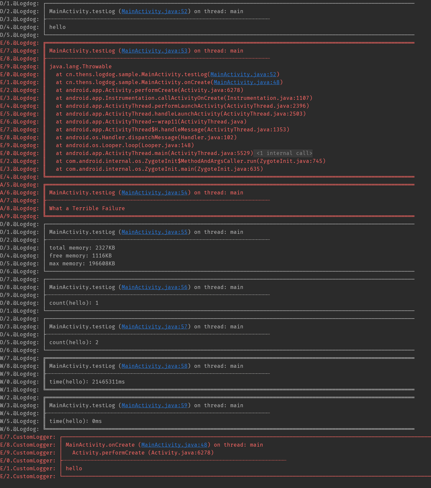

# Logdog

[](https://jitpack.io/#7hens/logdog)

[](https://github.com/7hens/logdog/blob/master/LICENSE)
[](https://github.com/7hens/logdog)

Yet another pretty logger for android.

## Setting up the dependency

last_version: [](https://jitpack.io/#7hens/logdog)

```groovy
implementation 'com.github.thens:logdog:<last_version>'
```

## Sample usage

```java
Logdog.get().debug("hello")
        .error(new Throwable())
        .wtf(false, "What a Terrible Failure")
        .debug(LogMessages.memory())
        .debug(LogMessages.count("hello"))
        .debug(LogMessages.count("hello"))
        .warn(LogMessages.time("hello"))
        .warn(LogMessages.time("hello"));
```

## Advanced

```java
Logdog customLogger = Logdog.create(new PrettyLogger(Logger.DEFAULT) {
    @Override
    public void log(int priority, String tag, String message) {
        if (!BuildConfig.DEBUG) return;
        super.log(priority, tag, message);
    }

    @Override
    protected Style getStyle(int priority, String tag) {
        return Style.SINGLE;
    }

    @Override
    protected int getMethodCount(int priority, String tag) {
        return 1;
    }

    @Override
    protected int getMethodOffset(int priority, String tag) {
        return 1;
    }
});
```

## Output



